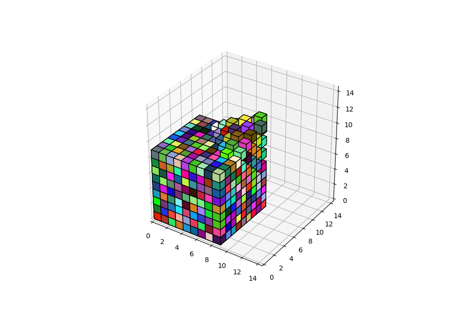

3d Chainmail
=======

A python module to show a 3d deformable volume using the chainmail algorithm. 

Requirements
-------------
* numpy
* matplotlib

Installation
-------------
### Install requirements with Conda
`conda env create -f environment.yml`

Running
-------
##### Change the parameters in main.py first (cube side, length, etc.) then,
`source activate chainmail`  
`python debug_deform_volume.py`

Testing
-------
##### Simply run pytest with an activated environment
`source activate chainmail`  
`pytest`

Documentation
-------------
#### 3D ChainMail: a Fast Algorithm for Deforming Volumetric Objects
http://www.merl.com/publications/docs/TR96-22.pdf

